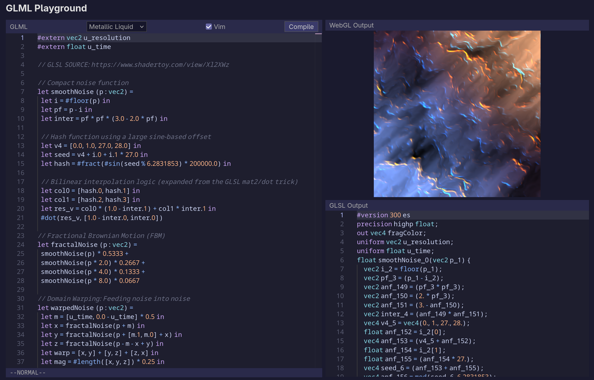

# GLML (OpenGL Meta Language)

GLML is an early stage functional domain-specific language for writing fragment shaders, targeting GLSL. Right now, it is primarily based on Hindley-Milner typing and features typeclasses for operator overloading. The long-term goal is to evolve into an ML-style language with [size-dependent types](https://futhark-lang.org/publications/fhpnc23.pdf).

Docs: [www.glml-lang.com](https://www.glml-lang.com/playground)

**Try GLML Playground:** [playground.glml-lang.com](https://playground.glml-lang.com)

    

